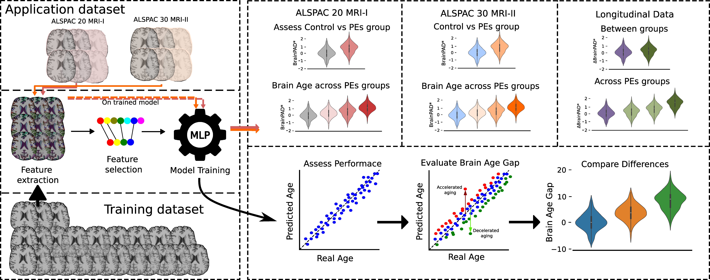

# ALSPAC_BA

<h2><em>Accelerated brain aging in young adults with psychotic experiences appears to normalize over time</em></h2>

The project was built on python 3.10 using the dependencies described at requirements.txt.
If problems with infoselect appear, download the package at https://github.com/felipemaiapolo/infoselect?tab=readme-ov-file modify setup.py to use scikit-learn instead of sklearn. 

The scripts generate the results shown in the paper. IDs are obfuscated for privacy reasons. Data is already preprocessed. 

Read the paper at: 