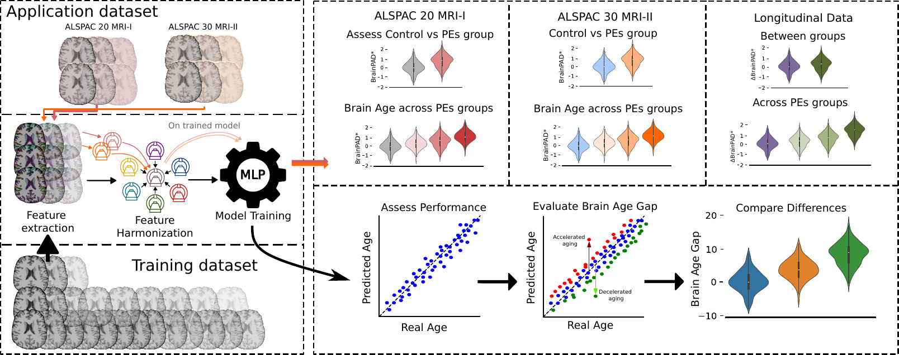

# ALSPAC_BA — Reproducibility code for *Increased Brain-Age Gap in Young Adults With Psychotic Experiences*

This repository contains the code used to produce the results in:

> Navarro-González R, Luque-Laguna P, de Luis-García R, Jones DK, Merritt K,
> David AS. **Increased Brain-Age Gap in Young Adults With Psychotic
> Experiences.** *Biological Psychiatry: Global Open Science* 6:100643 (2026).
> https://doi.org/10.1016/j.bpsgos.2025.100643

The brain-age model is a multilayer perceptron trained on 2628 T1-weighted
MRI scans (ages 6–50) and applied to the ALSPAC-PE cohort at ages 20 and 30.
Linear mixed-effects models test cross-sectional, severity and longitudinal
hypotheses on the bias-corrected brain-age gap (BrainPAD).

## Pipeline at a glance



```
raw FastSurfer features
        │
        ▼
01_harmonize.py            ComBat-GAM (vendored fork)
        │
        ▼
02_train_MLP.py            MLP, 1 hidden layer (16 units), Huber β=3
        │
        ▼
03_predict_and_correct.py  Cole + Zhang bias correction
        │           ┌──────────────────────────────────────┐
        │           ▼                                      ▼
        │     06_figure3_predictions.py          04_descriptive_stats.py
        │
        ▼
07_export_LMM_input.py     long-form table for R
        │
        ▼
07_LMM_main.R              nlme + emmeans + contrasts (Table 2)
        │           ┌──────────────────────────────────────┐
        │           ▼                                      ▼
        │     07_LMM_plots.py                    08_LMM_sensitivity.R
        │     (Figs 5, 6)                        (Euler 5%, depression)
        │
        ▼
09_reliability.py          ICC, SEM, Bland-Altman (Fig S5)
10_model_free_validation.py PCA + APC (Fig S6)
11_power_LPEs1.R           Monte-Carlo power (Table S18)
12_power_LPEs2.R
```

## Repository layout

```
ALSPAC_BA/
├── README.md                    this file
├── LICENSE                      MIT
├── requirements.txt             Python dependencies
├── requirements_R.txt           R packages
├── .gitignore
│
├── src/                         pipeline code
│   ├── 01_harmonize.py
│   ├── 02_train_MLP.py
│   ├── 03_predict_and_correct.py
│   ├── 04_descriptive_stats.py
│   ├── 05_supplement_tables.py
│   ├── 06_figure3_predictions.py
│   ├── 07_export_LMM_input.py
│   ├── 07_LMM_main.R
│   ├── 07_LMM_plots.py
│   ├── 08_LMM_sensitivity.R
│   ├── 09_reliability.py
│   ├── 10_model_free_validation.py
│   ├── 11_power_LPEs1.R
│   ├── 12_power_LPEs2.R
│   ├── 13_supplement_figures.py
│   ├── utils/
│   │   ├── train_utils.py
│   │   └── harmonize_utils.py
│   └── MultilayerPerceptron/
│       └── MLP_1_layer.py
│
├── tools/
│   └── obfuscate_ids.py         one-shot ID anonymisation helper
├── neuroharmonize/              vendored ComBat-GAM fork (with diagnostics)
├── data/                        input + intermediate CSVs (obfuscated IDs)
├── model/                       trained MLP + bias-correction reference
└── figures/                     output SVG / PNG land here
```

## Setup

### Python (3.10+)

```bash
python -m venv .venv
source .venv/bin/activate
pip install -r requirements.txt
```

### R (4.4+)

```r
install.packages(scan("requirements_R.txt", what = ""))
```

### Vendored harmonization library

`neuroharmonize/` is a local fork of [neuroHarmonize](https://github.com/rpomponio/neuroHarmonize) with two added diagnostic functions used to produce supplement Table S4. It is imported directly from disk; no `pip install` required, but scripts must be run from the repo root or `src/` so the relative import resolves.

## License

MIT — see `LICENSE`.

## Citation

```bibtex
@article{navarro2026brainage,
  author  = {Navarro-Gonz\'alez, Rafael and Luque-Laguna, Pedro
             and de Luis-Garc\'ia, Rodrigo and Jones, Derek K
             and Merritt, Kate and David, Anthony S},
  title   = {Increased Brain-Age Gap in Young Adults With Psychotic Experiences},
  journal = {Biological Psychiatry: Global Open Science},
  year    = {2026},
  volume  = {6},
  pages   = {100643},
  doi     = {10.1016/j.bpsgos.2025.100643}
}
```
